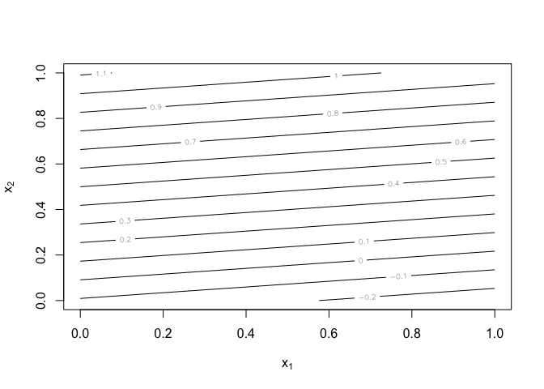

Homework 1
================
Jordan Nieusma
January 19, 2023

Using the RMarkdown/knitr/github mechanism, implement the following
tasks by extending the example R script mixture-data-lin-knn.R:

\[x\] Paste the code from the mixture-data-lin-knn.R file into the
homework template Knitr document.

\[x\] Read the help file for R’s built-in linear regression function lm

\[x\] Re-write the functions fit_lc and predict_lc using lm, and the
associated predict method for lm objects.

\[x\] Consider making the linear classifier more flexible, by adding
squared terms for x1 and x2 to the linear model

\[x\] Describe how this more flexible model affects the bias-variance
tradeoff

``` r
library("class")
library("dplyr")
```

    ## 
    ## Attaching package: 'dplyr'

    ## The following objects are masked from 'package:stats':
    ## 
    ##     filter, lag

    ## The following objects are masked from 'package:base':
    ## 
    ##     intersect, setdiff, setequal, union

``` r
## load binary classification example data from author website 
## 'ElemStatLearn' package no longer available
load(url('https://web.stanford.edu/~hastie/ElemStatLearn/datasets/ESL.mixture.rda'))
dat <- ESL.mixture
```

``` r
# plot data points and decision boundary
plot_mix_data <- function(dat, datboot=NULL) {
  if(!is.null(datboot)) {
    dat$x <- datboot$x
    dat$y <- datboot$y
  }
  plot(dat$x[,1], dat$x[,2],
       col=ifelse(dat$y==0, 'blue', 'orange'),
       pch=20,
       xlab=expression(x[1]),
       ylab=expression(x[2]))
  ## draw Bayes (True) classification boundary
  prob <- matrix(dat$prob, length(dat$px1), length(dat$px2)) # creates 69 x 99 matrix
  cont <- contourLines(dat$px1, dat$px2, prob, levels=0.5) 
  rslt <- sapply(cont, lines, col='purple')
}

plot_mix_data(dat)
```

<!-- -->

## Re-write the functions fit_lc and predict_lc using lm and the associated predict method for lm objects:

``` r
# recall that x = input, y = quantitative output
## fit linear classifier

# Modified fit_lc:
fit_lc <- function(y, x1, x2) {
  beta <- lm(y ~ x1 + x2)
  beta
  
  # original code: 
  # x <- cbind(1, x)   # adds column of 1s to dat$x
  # beta <- drop(solve(t(x)%*%x)%*%t(x)%*%y)   # dot product of (x*x)-1 * (x*y) 
}

# Modified predict_lc:
## make predictions from linear classifier
predict_lc <- function(x, beta) {
  x <- data.frame(1, x)
  predict.lm(object = beta, newdata = x)
  # original code:
  # cbind(1, x) %*% beta
}

## fit model to mixture data and make predictions
lc_beta <- fit_lc(dat$y, dat$x[,1], dat$x[,2])
lc_pred <- predict_lc(dat$xnew, lc_beta)

## reshape predictions as a matrix
lc_pred <- matrix(lc_pred, length(dat$px1), length(dat$px2))
contour(lc_pred,
      xlab=expression(x[1]),
      ylab=expression(x[2]))
```

<!-- -->

``` r
## find the contours in 2D space such that lc_pred == 0.5
lc_cont <- contourLines(dat$px1, dat$px2, lc_pred, levels=0.5)

## plot data and decision surface
plot_mix_data(dat)
sapply(lc_cont, lines)
```

<!-- -->

    ## [[1]]
    ## NULL

## Consider making the linear classifier more flexible by adding squared terms for x1 and x2 to the linear model:

``` r
# Modified fit_lc to include squared x1 and x2:
fit_lc <- function(y, x1, x2) {
  beta <- lm(y ~ x1 + x2 + I(x1^2) + I(x2^2)) 
  beta
  
  # original code: 
  # x <- cbind(1, x)   # adds column of 1s to dat$x
  # beta <- drop(solve(t(x)%*%x)%*%t(x)%*%y)   # dot product of (x*x)-1 * (x*y) 
}

# Modified predict_lc:
## make predictions from linear classifier
predict_lc <- function(x, beta) {
  x <- data.frame(1, x)
  predict.lm(object = beta, newdata = x)
  # original code:
  # cbind(1, x) %*% beta
}

## fit model to mixture data and make predictions
lc_beta <- fit_lc(dat$y, dat$x[,1], dat$x[,2])
lc_pred <- predict_lc(dat$xnew, lc_beta)

## reshape predictions as a matrix
lc_pred <- matrix(lc_pred, length(dat$px1), length(dat$px2))
contour(lc_pred,
      xlab=expression(x[1]),
      ylab=expression(x[2]))
```

<!-- -->

``` r
## find the contours in 2D space such that lc_pred == 0.5
lc_cont <- contourLines(dat$px1, dat$px2, lc_pred, levels=0.5)

## plot data and decision surface
plot_mix_data(dat)
sapply(lc_cont, lines)
```

<!-- -->

    ## [[1]]
    ## NULL

## Describe how this more flexible model affects the bias-variance tradeoff:

Variance refers to the amount by which the predicted values would change
if estimated using a different training data set. Ideally, these
estimates should not have variance between training data sets; a method
with high variance means that small changes in the training data can
yield large changes in the predicted values.

Bias refers to the error that is introduced approximating a real-life
problem as a statistical model, since a statistical model inherently is
a simplification of the real-life problem.

In general, the higher the flexibility of a model, the more strongly
variance and bias are inversely related (as variance increases, bias
will decrease and vice versa).
