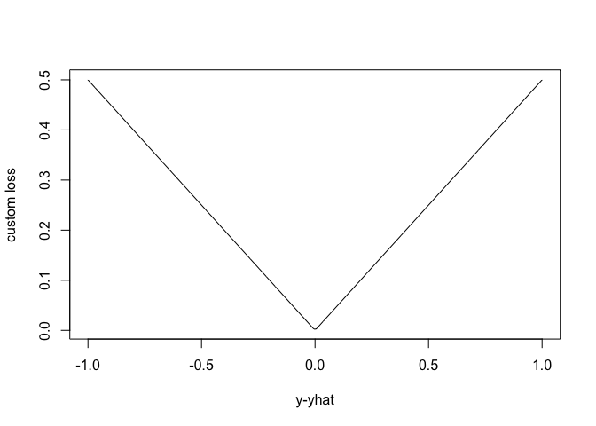
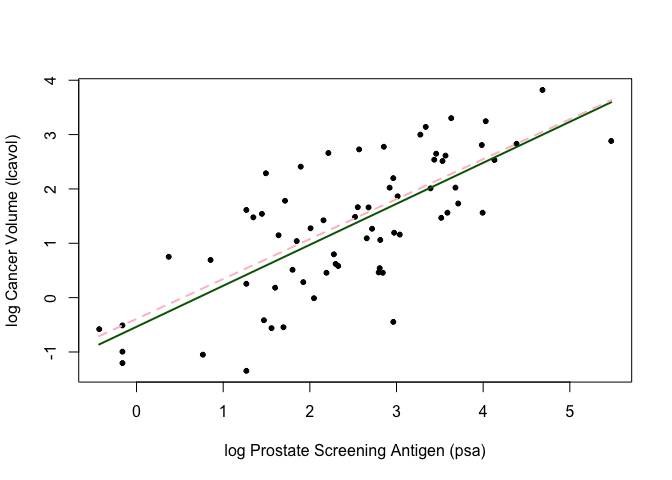
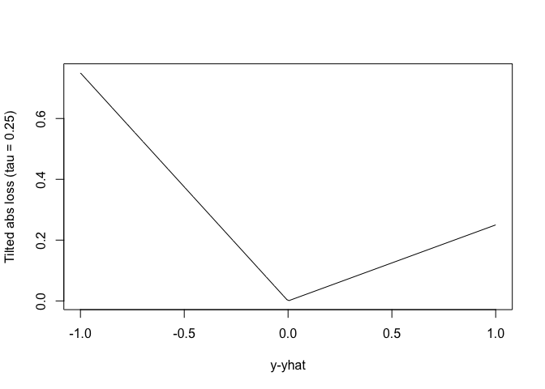
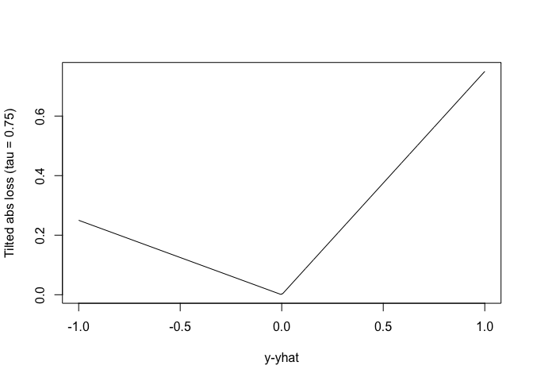
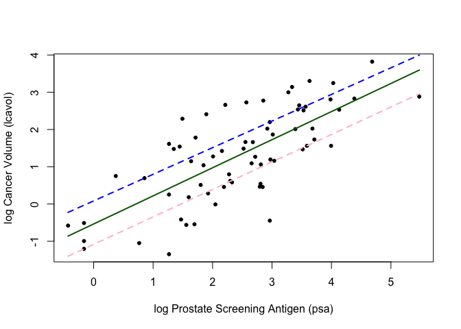

Homework 2
================
Jordan Nieusma
January 19, 2023

## Setup:

``` r
library(dplyr)
```

    ## 
    ## Attaching package: 'dplyr'

    ## The following objects are masked from 'package:stats':
    ## 
    ##     filter, lag

    ## The following objects are masked from 'package:base':
    ## 
    ##     intersect, setdiff, setequal, union

``` r
## load prostate data
prostate <- 
  read.table(url(
    'https://web.stanford.edu/~hastie/ElemStatLearn/datasets/prostate.data'))
```

``` r
## subset to training examples
prostate_train <- subset(prostate, train==TRUE)

## plot lcavol vs lpsa
plot_psa_data <- function(dat=prostate_train) {
  plot(dat$lpsa, dat$lcavol,
       xlab="log Prostate Screening Antigen (psa)",
       ylab="log Cancer Volume (lcavol)",
       pch = 20)
}
plot_psa_data()
```

<!-- -->

``` r
############################
## regular linear regression
############################

## L2 loss function
L2_loss <- function(y, yhat)
  (y-yhat)^2

## fit simple linear model using numerical optimization
fit_lin <- function(y, x, loss=L2_loss, beta_init = c(-0.51, 0.75)) {
  err <- function(beta)
    mean(loss(y,  beta[1] + beta[2]*x))
  beta <- optim(par = beta_init, fn = err)
  return(beta)
}

## make predictions from linear model
predict_lin <- function(x, beta)
  beta[1] + beta[2]*x

## fit linear model
lin_beta <- fit_lin(y=prostate_train$lcavol,
                    x=prostate_train$lpsa,
                    loss=L2_loss)

## compute predictions for a grid of inputs
x_grid <- seq(min(prostate_train$lpsa),
              max(prostate_train$lpsa),
              length.out=100)
lin_pred <- predict_lin(x=x_grid, beta=lin_beta$par)

## plot data
plot_psa_data()

## plot predictions
lines(x=x_grid, y=lin_pred, col='darkgreen', lwd=2)

## do the same thing with 'lm'
lin_fit_lm <- lm(lcavol ~ lpsa, data=prostate_train)

## make predictins using 'lm' object
lin_pred_lm <- predict(lin_fit_lm, data.frame(lpsa=x_grid))

## plot predictions from 'lm'
lines(x=x_grid, y=lin_pred_lm, col='pink', lty=2, lwd=2)
```

<!-- -->

## Instructions:

### 1) Write functions that implement the L1 loss and tilted absolute loss functions.

### 2) Create a figure that shows lpsa (x-axis) versus lcavol (y-axis). Add and label (using the ‘legend’ function) the linear model predictors associated with L2 loss (squared error loss), L1 loss (absolute error loss), and tilted absolute value loss for tau = 0.25 and 0.75.

``` r
## 1) custom loss functions implementing L1 loss and tilted abs loss
L1_loss <- function(y, yhat)
  qrnn::tilted.abs(y-yhat, tau = 0.5)

L1_tilted_loss_25 <- function(y, yhat, tau=0.25)
  qrnn::tilted.abs(y-yhat, tau)

L1_tilted_loss_75 <- function(y, yhat, tau=0.75)
  qrnn::tilted.abs(y-yhat, tau)
```

``` r
## 2)
## plot L1 loss function
err_grd <- seq(-1,1,length.out=200)
plot(err_grd, L1_loss(err_grd,0), type='l',
     xlab='y-yhat', ylab='custom loss')
```

<!-- -->

``` r
## fit linear model with custom loss (L1)
lin_beta_custom <- fit_lin(y=prostate_train$lcavol,
                    x=prostate_train$lpsa,
                    loss=L1_loss)

lin_pred_custom <- predict_lin(x=x_grid, beta=lin_beta_custom$par)

## plot data
plot_psa_data()

## plot predictions from L2 loss
lines(x=x_grid, y=lin_pred, col='darkgreen', lwd=2)

## plot predictions from L1 loss
lines(x=x_grid, y=lin_pred_custom, col='pink', lwd=2, lty=2)
```

<!-- -->

``` r
##############################
## plot L1_tilted loss function where tau = 0.25 & 0.75
err_grd <- seq(-1,1,length.out=200)
plot(err_grd, L1_tilted_loss_25(err_grd,0,tau=0.25), type='l',
     xlab='y-yhat', ylab='Tilted abs loss (tau = 0.25)')
```

<!-- -->

``` r
err_grd <- seq(-1,1,length.out=200)
plot(err_grd, L1_tilted_loss_75(err_grd,0,tau=0.75), type='l',
     xlab='y-yhat', ylab='Tilted abs loss (tau = 0.75)')
```

<!-- -->

``` r
## fit linear model with custom loss (L1)
lin_beta_custom_25 <- fit_lin(y=prostate_train$lcavol,
                    x=prostate_train$lpsa,
                    loss=L1_tilted_loss_25)
lin_beta_custom_75 <- fit_lin(y=prostate_train$lcavol,
                    x=prostate_train$lpsa,
                    loss=L1_tilted_loss_75)

lin_pred_custom_25 <- predict_lin(x=x_grid, beta=lin_beta_custom_25$par)

lin_pred_custom_75 <- predict_lin(x=x_grid, beta=lin_beta_custom_75$par)

## plot data
plot_psa_data()

## plot predictions from L2 loss
lines(x=x_grid, y=lin_pred, col='darkgreen', lwd=2)

## plot predictions from tilted L1 loss, tau=0.25
lines(x=x_grid, y=lin_pred_custom_25, col='pink', lwd=2, lty=2)

## plot predictions from tilted L1 loss, tau=0.75
lines(x=x_grid, y=lin_pred_custom_75, col='blue', lwd=2, lty=2)
```

<!-- --> \###
Write functions to fit and predict from a simple nonlinear model with
three parameters defined by ‘beta\[1\] + beta\[2\]*exp(-beta\[3\]*x)’.
Hint: make copies of ‘fit_lin’ and ‘predict_lin’ and modify them to fit
the nonlinear model. Use c(-1.0, 0.0, -0.3) as ‘beta_init’.

### Create a figure that shows lpsa (x-axis) versus lcavol (y-axis). Add and label (using the ‘legend’ function) the nonlinear model predictors associated with L2 loss, L1 loss, and tilted absolute value loss for tau = 0.25 and 0.75.
