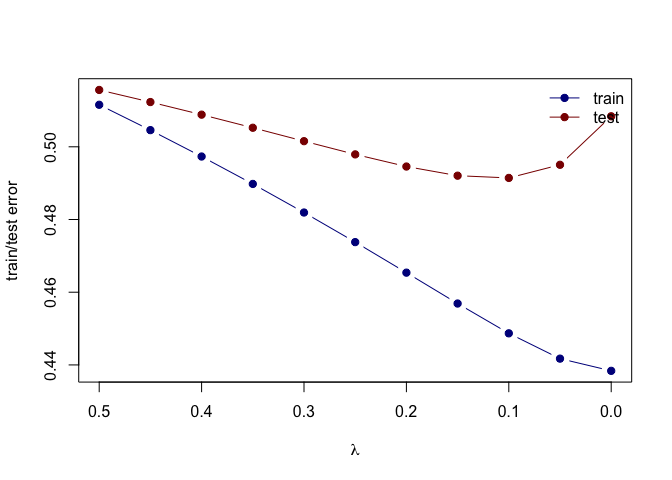
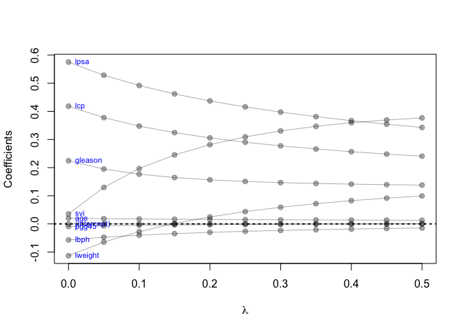

HW 03
================
Jordan Nieusma
2023-02-14

## Assignment tasks:

\[X\] Use the prostate cancer data.

``` r
library('splines')        ## for 'bs'
library('dplyr')          ## for 'select', 'filter', and others
```

    ## 
    ## Attaching package: 'dplyr'

    ## The following objects are masked from 'package:stats':
    ## 
    ##     filter, lag

    ## The following objects are masked from 'package:base':
    ## 
    ##     intersect, setdiff, setequal, union

``` r
library('magrittr')       ## for '%<>%' operator
library('glmnet')         ## for 'glmnet' 
```

    ## Loading required package: Matrix

    ## Loaded glmnet 4.1-6

``` r
# load prostate data
prostate <- 
  read.table(url(
    'https://web.stanford.edu/~hastie/ElemStatLearn/datasets/prostate.data'))

## split prostate into testing and training subsets
prostate_train <- prostate %>%
  filter(train == TRUE) %>% 
  select(-train)

prostate_test <- prostate %>%
  filter(train == FALSE) %>% 
  select(-train)

x_train <- prostate_train %>%
  select(-lcavol)

x_test  <- prostate_test %>%
  select(-lcavol)

y_train <- prostate_train %>%
  select(lcavol)

y_test <- prostate_test %>%
  select(lcavol)
```

\[X\] Use the cor function to reproduce the correlations listed in HTF
Table 3.1, page 50.

``` r
prostate_corr <- prostate %>%
  select(lcavol, lweight, age, lbph, svi, lcp, gleason)
x <- prostate_corr %>% select(-lcavol)
y <- prostate_corr %>% select(-gleason)

corr_matrix = cor(x, y)

corr_matrix[upper.tri(corr_matrix)] <-  NA 
corr_matrix
```

    ##            lcavol    lweight       age         lbph       svi       lcp
    ## lweight 0.2805214         NA        NA           NA        NA        NA
    ## age     0.2249999 0.34796911        NA           NA        NA        NA
    ## lbph    0.0273497 0.44226440 0.3501859           NA        NA        NA
    ## svi     0.5388450 0.15538490 0.1176580 -0.085843238        NA        NA
    ## lcp     0.6753105 0.16453714 0.1276678 -0.006999431 0.6731112        NA
    ## gleason 0.4324171 0.05688209 0.2688916  0.077820447 0.3204122 0.5148301

\[X\] Treat lcavol as the outcome, and use all other variables in the
data set as predictors. \[X\] With the training subset of the prostate
data, train a least-squares regression model with all predictors using
the lm function.

``` r
## split data into train/test
prostate_train <- prostate %>%
  filter(train == TRUE) %>% 
  select(-train)

prostate_test <- prostate %>%
  filter(train == FALSE) %>% 
  select(-train)
```

``` r
# fit linear model
lcavol_fit <- lm(lcavol ~ ., data=prostate_train)
lcavol_fit
```

    ## 
    ## Call:
    ## lm(formula = lcavol ~ ., data = prostate_train)
    ## 
    ## Coefficients:
    ## (Intercept)      lweight          age         lbph          svi          lcp  
    ##   -2.173357    -0.113370     0.020102    -0.056981     0.035116     0.418455  
    ##     gleason        pgg45         lpsa  
    ##    0.224387    -0.009113     0.575455

\[X\] Use the testing subset to compute the test error (average
squared-error loss) using the fitted least-squares regression model.

``` r
## test_error 
L2_loss <- function(y, yhat)
  (y-yhat)^2

## functions to compute testing/training error with lm
error <- function(dat, fit, loss=L2_loss) {
  y_hat <- predict(fit, newdata=dat)
  mean(loss(dat$lcavol, y_hat))
}

test_error <- error(prostate_test, lcavol_fit)
test_error
```

    ## [1] 0.5084068

\[X\] Train a ridge regression model using the glmnet function, and tune
the value of lambda (i.e., use guess and check to find the value of
lambda that approximately minimizes the test error).

``` r
## first create an input matrix and output vector
form  <- lcavol ~  lweight + age + lbph + lcp + pgg45 + lpsa + svi + gleason
x_inp <- model.matrix(form, data=prostate_train)
y_out <- prostate_train$lcavol
# fit ridge regression model
ridge_fit <- glmnet(x=x_inp, y=y_out, alpha=0, lambda=seq(0.5, 0, -0.05))
ridge_fit
```

    ## 
    ## Call:  glmnet(x = x_inp, y = y_out, alpha = 0, lambda = seq(0.5, 0,      -0.05)) 
    ## 
    ##    Df  %Dev Lambda
    ## 1   8 66.37   0.50
    ## 2   8 66.83   0.45
    ## 3   8 67.30   0.40
    ## 4   8 67.80   0.35
    ## 5   8 68.32   0.30
    ## 6   8 68.85   0.25
    ## 7   8 69.40   0.20
    ## 8   8 69.96   0.15
    ## 9   8 70.50   0.10
    ## 10  8 70.96   0.05
    ## 11  8 71.18   0.00

``` r
## functions to compute testing/training error with glmnet
error <- function(dat, fit, lam, form, loss=L2_loss) {
  x_inp <- model.matrix(form, data=dat)
  y_out <- dat$lcavol
  y_hat <- predict(fit, newx=x_inp, s=lam)  ## see predict.elnet
  mean(loss(y_out, y_hat))
}

## testing error at lambda=0
error(prostate_test, ridge_fit, lam=0, form=form)
```

    ## [1] 0.5083923

``` r
## testing error at lambda=0.05
error(prostate_test, ridge_fit, lam=0.05, form=form)
```

    ## [1] 0.4950521

``` r
## testing error at lambda=0.1
error(prostate_test, ridge_fit, lam=0.1, form=form)
```

    ## [1] 0.4914336

``` r
## testing error at lambda=0.12
error(prostate_test, ridge_fit, lam=0.12, form=form)
```

    ## [1] 0.4911847

``` r
## testing error at lambda=0.13
error(prostate_test, ridge_fit, lam=0.13, form=form)
```

    ## [1] 0.4913086

``` r
## testing error at lambda=0.15
error(prostate_test, ridge_fit, lam=0.15, form=form)
```

    ## [1] 0.4920532

``` r
## testing error at lambda=0.2
error(prostate_test, ridge_fit, lam=0.2, form=form)
```

    ## [1] 0.4945718

*Lamba is tuned to minimize test error at approximately lam=0.12*

\[X\] Create a figure that shows the training and test error associated
with ridge regression as a function of lambda \[X\] Create a path
diagram of the ridge regression analysis, similar to HTF Figure 3.8

``` r
## compute training and testing errors as function of lambda
err_train_1 <- sapply(ridge_fit$lambda, function(lam) 
  error(prostate_train, ridge_fit, lam, form))
err_test_1 <- sapply(ridge_fit$lambda, function(lam) 
  error(prostate_test, ridge_fit, lam, form))

## plot test/train error
plot(x=range(ridge_fit$lambda),
     y=range(c(err_train_1, err_test_1)),
     xlim=rev(range(ridge_fit$lambda)),
     type='n',
     xlab=expression(lambda),
     ylab='train/test error')
points(ridge_fit$lambda, err_train_1, pch=19, type='b', col='darkblue')
points(ridge_fit$lambda, err_test_1, pch=19, type='b', col='darkred')
legend('topright', c('train','test'), lty=1, pch=19,
       col=c('darkblue','darkred'), bty='n')
```

<!-- -->

``` r
## plot path diagram
plot(x=range(ridge_fit$lambda),
     y=range(as.matrix(ridge_fit$beta)),
     type='n',
     xlab=expression(lambda),
     ylab='Coefficients')
for(i in 1:nrow(ridge_fit$beta)) {
  points(x=ridge_fit$lambda, y=ridge_fit$beta[i,], pch=19, col='#00000055')
  lines(x=ridge_fit$lambda, y=ridge_fit$beta[i,], col='#00000055')
}
text(x=0, y=ridge_fit$beta[,ncol(ridge_fit$beta)], 
     labels=rownames(ridge_fit$beta),
     xpd=NA, pos=4, srt=0, cex=0.7, col="blue")
abline(h=0, lty=3, lwd=2)
```

<!-- -->
