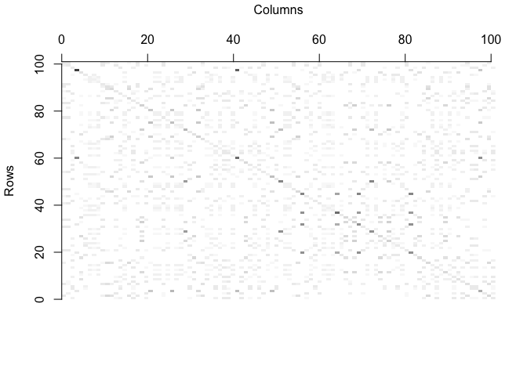
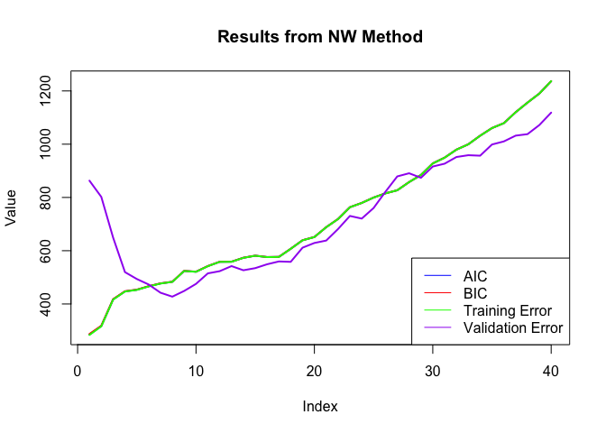
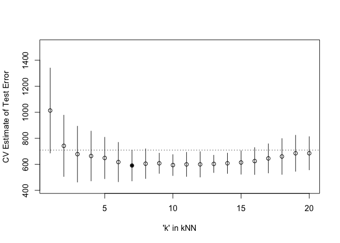

Homework 4
================
Jordan Nieusma
2023-02-27

## Goal: Understand and implement various ways to approximate test error.

## Notebook setup

Load MASS, manipulate, and tidyr packages.

Get data.

``` r
y <- mcycle$accel
x <- matrix(mcycle$times, length(mcycle$times), 1)

plot(x, y, xlab="Time (ms)", ylab="Acceleration (g)")
```

<!-- -->

## Task 1: Randomly split the mcycle data into training (75%) and validation (25%) subsets.

``` r
set.seed(123)

# Sample from mcycle data
sample <- sample(c(TRUE,FALSE), nrow(mcycle), 
                 replace=TRUE, prob=c(0.75,0.25))

# Train-test split
train_size <- round(nrow(mcycle) * 0.75)
train_index <- sample(seq_len(nrow(mcycle)), size = train_size, replace = FALSE)
train <- mcycle[train_index, ]
validation <- mcycle[-train_index, ]

# Set y = accel and X = times
y_train <- train$accel
X_train <- matrix(train$times, length(train$times), 1)
y_validation = validation$accel
X_validation = matrix(validation$times, length(validation$times),1)
```

## Functions to implement tasks on split data

``` r
## Epanechnikov kernel function
## x  - n x p matrix of training inputs
## x0 - 1 x p input where to make prediction
## lambda - bandwidth (neighborhood size)
kernel_epanechnikov <- function(x, x0, lambda=1) {
  d <- function(t)
    ifelse(t <= 1, 3/4*(1-t^2), 0)
  z <- t(t(x) - x0)
  d(sqrt(rowSums(z*z))/lambda)
}

## k-NN kernel function
## x  - n x p matrix of training inputs
## x0 - 1 x p input where to make prediction
## k  - number of nearest neighbors
kernel_k_nearest_neighbors <- function(x, x0, k=1) {
  ## compute distance betwen each x and x0
  z <- t(t(x) - x0)
  d <- sqrt(rowSums(z*z))

  ## initialize kernel weights to zero
  w <- rep(0, length(d))
  
  ## set weight to 1 for k nearest neighbors
  w[order(d)[1:k]] <- 1
  
  return(w)
}

## Make predictions using the NW method
## y  - n x 1 vector of training outputs
## x  - n x p matrix of training inputs
## x0 - m x p matrix where to make predictions
## kern  - kernel function to use
## ... - arguments to pass to kernel function
nadaraya_watson <- function(y, x, x0, kern, ...) {
  k <- t(apply(x0, 1, function(x0_) {
    k_ <- kern(x, x0_, ...)
    k_/sum(k_)
  }))
  yhat <- drop(k %*% y)
  attr(yhat, 'k') <- k
  return(yhat)
}

## Helper function to view kernel (smoother) matrix
matrix_image <- function(x) {
  rot <- function(x) t(apply(x, 2, rev))
  cls <- rev(gray.colors(20, end=1))
  image(rot(x), col=cls, axes=FALSE)
  xlb <- pretty(1:ncol(x))
  xat <- (xlb-0.5)/ncol(x)
  ylb <- pretty(1:nrow(x))
  yat <- (ylb-0.5)/nrow(x)
  axis(3, at=xat, labels=xlb)
  axis(2, at=yat, labels=ylb)
  mtext('Rows', 2, 3)
  mtext('Columns', 3, 3)
}

## Compute effective df using NW method
## y  - n x 1 vector of training outputs
## x  - n x p matrix of training inputs
## kern  - kernel function to use
## ... - arguments to pass to kernel function
effective_df <- function(y, x, kern, ...) {
  y_hat <- nadaraya_watson(y, x, x,
    kern=kern, ...)
  sum(diag(attr(y_hat, 'k')))
}

## loss function
## y    - train/test y
## yhat - predictions at train/test x
loss_squared_error <- function(y, yhat)
  (y - yhat)^2

## test/train error
## y    - train/test y
## yhat - predictions at train/test x
## loss - loss function
error <- function(y, yhat, loss=loss_squared_error)
  mean(loss(y, yhat))

## AIC
## y    - training y
## yhat - predictions at training x
## d    - effective degrees of freedom
aic <- function(y, yhat, d)
  error(y, yhat) + 2/length(y)*d

## BIC
## y    - training y
## yhat - predictions at training x
## d    - effective degrees of freedom
bic <- function(y, yhat, d)
  error(y, yhat) + log(length(y))/length(y)*d


## make predictions using NW method at training inputs
y_hat <- nadaraya_watson(y_train, X_train, X_train,
  kernel_epanechnikov, lambda=5)

## view kernel (smoother) matrix
matrix_image(attr(y_hat, 'k'))
```

<!-- -->

## Task 2: Using the mcycle data, consider predicting the mean acceleration as a function of time. Use the Nadaraya-Watson method with the k-NN kernel function to create a series of prediction models by varying the tuning parameter over a sequence of values.

``` r
# Create an empty matrix to store results
result_matrix <- matrix(nrow = 40, ncol = 4)

# Assign column names to the matrix
colnames(result_matrix) <- c("train_err", "aic", "bic", "validation_err")

for (i in 1:40){
   ## make predictions using NW method at training inputs
   y_hat_train <- nadaraya_watson(y_train, X_train, X_train,
     kern=kernel_k_nearest_neighbors, k=i)
   y_hat_validation = nadaraya_watson(y_train, X_train, X_validation,
     kern=kernel_k_nearest_neighbors, k=i)
   edf <- effective_df(y_train, X_train, 
     kern=kernel_k_nearest_neighbors, k=i)
   
   result_matrix[i, "aic"] <- aic(y_train, y_hat_train, edf)
   result_matrix[i, "bic"] <- bic(y_train, y_hat_train, edf)
   result_matrix[i, "train_err"] <- error(y_train, y_hat_train)
   result_matrix[i, "validation_err"] <- error(y_validation, y_hat_validation)
   
}

plot(result_matrix[,"aic"], type = "l", col = "blue", lwd=2, xlab = "Index", ylab = "Value", main = "Results from NW Method")
lines(result_matrix[,"bic"], col = "red", lwd=2)
lines(result_matrix[,"train_err"], col = "green", lwd=2)
lines(result_matrix[,"validation_err"], col = "purple", lwd=2)
legend("bottomright", legend = c("AIC", "BIC", "Training Error", "Validation Error"), col = c("blue", "red", "green", "purple"), lty = 1)
```

<!-- -->

## Task 3: For each value of the tuning parameter, perform 5-fold cross-validation using the combined training and validation data. This results in 5 estimates of test error per tuning parameter value.

``` r
# Create CV folds (k=5)
folds <- createFolds(x, k=5)

cross_val <- function(kNN = 10, flds=folds) {
  cverr <- rep(NA, length(flds))
  for(tst_idx in 1:length(flds)) { ## for each fold
    
    ## get training and testing data
    inc_trn <- mcycle[-flds[[tst_idx]],]
    inc_tst <- mcycle[ flds[[tst_idx]],]
    ## fit kNN model to training data
    knn_fit <- knnreg(accel ~ times,
                      k=kNN, data=inc_trn)
  
    pre_tst <- predict(knn_fit, inc_tst)
    cverr[tst_idx] <- mean((inc_tst$accel - pre_tst)^2)
    }
  return(cverr)
}

## Compute 5-fold CV for kNN = 1:20
cverrs <- sapply(1:20, cross_val)
print(cverrs) ## rows are k-folds (1:5), cols are kNN (1:20)
```

    ##           [,1]     [,2]     [,3]     [,4]     [,5]     [,6]     [,7]     [,8]
    ## [1,] 1138.2141 888.2318 722.5614 799.5303 649.8704 681.9446 657.7670 658.9194
    ## [2,]  937.3508 889.6937 871.4267 861.1105 866.8560 791.8358 695.3184 691.6852
    ## [3,]  794.2910 505.3590 490.1872 461.9066 495.6457 436.4118 435.6086 459.9587
    ## [4,]  684.0625 466.4974 419.8662 456.7149 496.4319 481.6371 490.7818 504.8046
    ## [5,] 1512.7653 959.8021 886.0814 739.3930 734.1818 694.6286 673.6069 708.4096
    ##          [,9]    [,10]    [,11]    [,12]    [,13]    [,14]    [,15]    [,16]
    ## [1,] 654.6853 631.5062 622.9041 630.7572 630.6460 631.3832 639.2257 699.2661
    ## [2,] 679.8480 687.7822 700.3131 678.2919 663.3247 718.2630 740.6181 723.0848
    ## [3,] 485.5181 469.3799 446.6936 429.2623 490.9910 501.0207 489.4965 458.5650
    ## [4,] 578.4215 576.2346 619.8366 623.2942 599.2927 600.2025 594.9408 628.8514
    ## [5,] 640.7495 605.1492 607.5933 636.5799 631.7107 588.9474 605.6599 614.7549
    ##         [,17]    [,18]    [,19]    [,20]
    ## [1,] 720.7292 778.0461 801.0436 787.1025
    ## [2,] 724.6744 742.5541 743.9979 726.5396
    ## [3,] 456.2420 426.9547 444.2641 471.2826
    ## [4,] 693.9398 690.3973 721.6949 770.1655
    ## [5,] 631.5519 662.6260 713.1138 669.5496

## Task 4: Plot the CV-estimated test error (average of the five estimates from each fold) as a function of the tuning parameter. Add vertical line segments to the figure (using the segments function in R) that represent one “standard error” of the CV-estimated test error (standard deviation of the five estimates from each fold).

``` r
# Get CV-estimated test error and standard deviation
cverrs_mean <- apply(cverrs, 2, mean)
cverrs_sd <- apply(cverrs, 2, sd)

## Plot the results of 5-fold CV for kNN = 1:20
plot(x=1:20, y=cverrs_mean, 
     ylim=range(cverrs),
     xlab="'k' in kNN", ylab="CV Estimate of Test Error")
segments(x0=1:20, x1=1:20,
         y0=cverrs_mean-cverrs_sd,
         y1=cverrs_mean+cverrs_sd)
best_idx <- which.min(cverrs_mean)
points(x=best_idx, y=cverrs_mean[best_idx], pch=20)
abline(h=cverrs_mean[best_idx] + cverrs_sd[best_idx], lty=3)
```

<!-- -->

## Task 6: Interpret the resulting figure and select a suitable value for the tuning parameter.

The k value should be selected so that each train/test split is
“representative” of the overall sample. In general, increasing k results
in increasing variance and decreasing bias. We accomplish this by
selecting the largest k value that is within one standard error of the
minimum error. In this case, the minimum error is at k=6, with the
dotted line representing the highest point in the standard error. Since
k=15 is the largest k value where its standard error falls below the
highest standard error of the k=6, thus we would select k=15 for the
tuning parameter.
