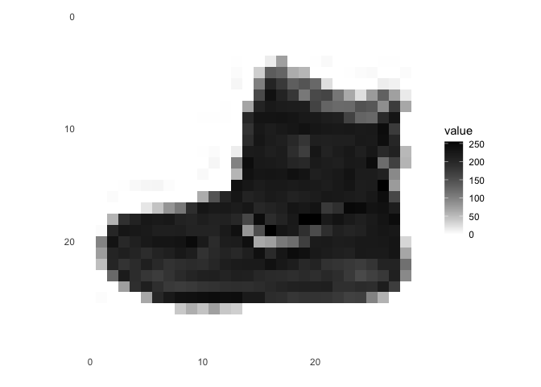
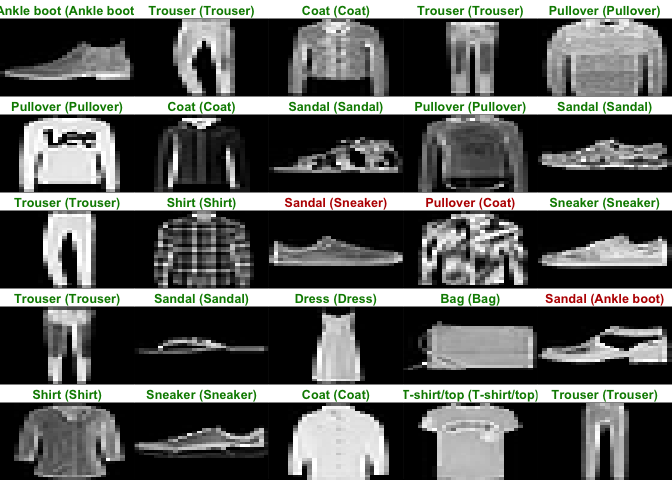
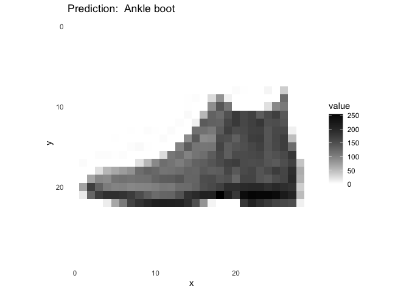
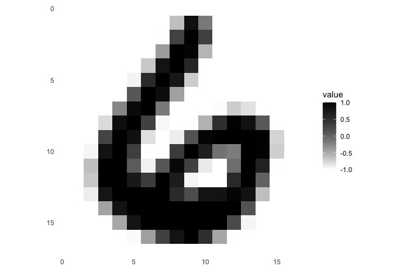
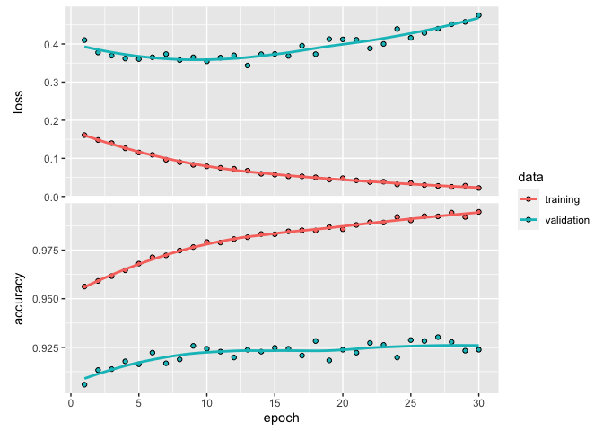

HW-6
================
Jordan Nieusma
2023-04-06

## Set up environment

Packages used: tensorflow, keras, tidyverse, ggplot2

## Goal

Construct a simple neural network

## Task 1: Step through the “Image Classification” tutorial on the RStudio Keras website. (<https://tensorflow.rstudio.com/tutorials/beginners/basic-ml/tutorial_basic_classification/>)

``` r
# prepare the data
fashion_mnist <- dataset_fashion_mnist()

c(train_images, train_labels) %<-% fashion_mnist$train
c(test_images, test_labels) %<-% fashion_mnist$test

# store class names for plotting
class_names = c('T-shirt/top',
                'Trouser',
                'Pullover',
                'Dress',
                'Coat',
                'Sandal',
                'Shirt',
                'Sneaker',
                'Bag',
                'Ankle boot')
# explore the data
dim(train_images)
```

    ## [1] 60000    28    28

``` r
dim(train_labels)
```

    ## [1] 60000

``` r
train_labels[1:20]
```

    ##  [1] 9 0 0 3 0 2 7 2 5 5 0 9 5 5 7 9 1 0 6 4

``` r
dim(test_images)
```

    ## [1] 10000    28    28

``` r
dim(test_labels)
```

    ## [1] 10000

``` r
# pre-process the data
image_1 <- as.data.frame(train_images[1, , ])
colnames(image_1) <- seq_len(ncol(image_1))
image_1$y <- seq_len(nrow(image_1))
image_1 <- gather(image_1, "x", "value", -y)
image_1$x <- as.integer(image_1$x)

# inspect first image
ggplot(image_1, aes(x = x, y = y, fill = value)) +
  geom_tile() +
  scale_fill_gradient(low = "white", high = "black", na.value = NA) +
  scale_y_reverse() +
  theme_minimal() +
  theme(panel.grid = element_blank())   +
  theme(aspect.ratio = 1) +
  xlab("") +
  ylab("")
```

<!-- -->

``` r
# scale train/test values
train_images <- train_images / 255
test_images <- test_images / 255

# display first 25 images
par(mfcol=c(5,5))
par(mar=c(0, 0, 1.5, 0), xaxs='i', yaxs='i')
for (i in 1:25) {
  img <- train_images[i, , ]
  img <- t(apply(img, 2, rev))
  image(1:28, 1:28, img, col = gray((0:255)/255), xaxt = 'n', yaxt = 'n',
        main = paste(class_names[train_labels[i] + 1]))
}
```

<!-- -->

``` r
# build the model
tutorial_model <- keras_model_sequential()
tutorial_model %>%
  layer_flatten(input_shape = c(28, 28)) %>%
  layer_dense(units = 128, activation = 'relu') %>%
  layer_dense(units = 10, activation = 'softmax')

# compile the model by selecting an optimizer, loss fn, and metric
tutorial_model %>% compile(
  optimizer = 'adam',
  loss = 'sparse_categorical_crossentropy',
  metrics = c('accuracy')
)

# train the model
tutorial_model %>% fit(train_images, train_labels, epochs = 5, verbose = 2)

# evaluate accuracy
tutorial_score <- tutorial_model %>% evaluate(test_images, test_labels, verbose = 0)

# print test loss and accuracy
cat('Test loss:', tutorial_score["loss"], "\n")
```

    ## Test loss: 0.3514509

``` r
cat('Test accuracy:', tutorial_score["accuracy"], "\n")
```

    ## Test accuracy: 0.8712

``` r
# predict
tutorial_predictions <- tutorial_model %>% predict(test_images)
tutorial_predictions[1, ]
```

    ##  [1] 1.574010e-05 6.347437e-10 4.512489e-08 3.737256e-09 6.805706e-08
    ##  [6] 3.044010e-02 1.920468e-06 3.160880e-02 2.546595e-05 9.379078e-01

``` r
which.max(tutorial_predictions[1, ])
```

    ## [1] 10

``` r
test_labels[1]
```

    ## [1] 9

``` r
# plot some images with their predictions
par(mfcol=c(5,5))
par(mar=c(0, 0, 1.5, 0), xaxs='i', yaxs='i')
for (i in 1:25) {
  img <- test_images[i, , ]
  img <- t(apply(img, 2, rev))
  # subtract 1 as labels go from 0 to 9
  predicted_label <- which.max(tutorial_predictions[i, ]) - 1
  true_label <- test_labels[i]
  if (predicted_label == true_label) {
    color <- '#008800'
  } else {
    color <- '#bb0000'
  }
  image(1:28, 1:28, img, col = gray((0:255)/255), xaxt = 'n', yaxt = 'n',
        main = paste0(class_names[predicted_label + 1], " (",
                      class_names[true_label + 1], ")"),
        col.main = color)
}
```

<!-- -->

``` r
# Predict for a single image
img <- test_images[1, , , drop = FALSE]
dim(img)
```

    ## [1]  1 28 28

``` r
predictions <- tutorial_model %>% predict(img)
predictions
```

    ##              [,1]         [,2]         [,3]         [,4]         [,5]
    ## [1,] 1.574013e-05 6.347446e-10 4.512502e-08 3.737257e-09 6.805733e-08
    ##            [,6]         [,7]       [,8]         [,9]     [,10]
    ## [1,] 0.03044013 1.920471e-06 0.03160877 2.546601e-05 0.9379079

``` r
# subtract 1 as labels are 0-based
prediction <- predictions[1, ] - 1
which.max(prediction)
```

    ## [1] 10

``` r
test_images_unscaled <- test_images*255

img_plot <- as.data.frame(test_images_unscaled[1, , ])
colnames(img_plot) <- seq_len(ncol(img_plot))
img_plot$y <- seq_len(nrow(img_plot))
img_plot <- gather(img_plot, "x", "value", -y)
img_plot$x <- as.integer(img_plot$x)

# inspect first image
ggplot(img_plot, aes(x = x, y = y, fill = value)) +
  geom_tile() +
  scale_fill_gradient(low = "white", high = "black", na.value = NA) +
  scale_y_reverse() +
  theme_minimal() +
  theme(panel.grid = element_blank())   +
  theme(aspect.ratio = 1) +
  labs(title=paste("Prediction: ", class_names[which.max(prediction)]))
```

<!-- -->

## Task 2: Use the Keras library to create a convolutional neural network similar to (or more sophisticated than) “Net-5” described in Elements of Statistical Learning, section 11.7. Refer to ConvNet tutorial on RStudio Keras (<https://tensorflow.rstudio.com/examples/cifar10_cnn>). Fit the CNN to the zipcode data from the authors website and create a figure that shows test error as a function of training epochs.

``` r
# read in zip data
train_zip <- read.delim("zip.train", header=FALSE, sep="")
test_zip <- read.delim("zip.test", header=FALSE, sep="")

# separate image data and labels
train_images <- as.matrix(train_zip[-c(1, 258)], byrow=TRUE)
train_images <- array_reshape(train_images, c(7291, 16, 16), order=c("C"))
train_labels <- as.vector(train_zip[['V1']])

test_images <- as.matrix(test_zip[-c(1, 258)], byrow=TRUE)
test_images <- array_reshape(test_images, c(2007, 16, 16), order=c("C"))
test_labels <- as.vector(test_zip[['V1']])

# plot first image from the data
image_1 <- as.data.frame(train_images[1, , ])
colnames(image_1) <- seq_len(ncol(image_1))
image_1$y <- seq_len(nrow(image_1))
image_1 <- gather(image_1, "x", "value", -y)
image_1$x <- as.integer(image_1$x)

ggplot(image_1, aes(x = x, y = y, fill = value)) +
  geom_tile() +
  scale_fill_gradient(low = "white", high = "black", na.value = NA) +
  scale_y_reverse() +
  theme_minimal() +
  theme(panel.grid = element_blank())   +
  theme(aspect.ratio = 1) +
  xlab("") +
  ylab("")
```

<!-- -->

``` r
# build model
model <- keras_model_sequential() %>%
  layer_conv_2d(filters=2, kernel_size=c(3,3), strides = c(1L,1L), input_shape=c(16,16,1), activation='relu') %>%
  layer_conv_2d(filters=4, kernel_size=c(5,5), strides=c(1L, 1L), activation='relu') %>%
  layer_flatten() %>%
  layer_dense(10)

# loss function
loss_fn <- loss_sparse_categorical_crossentropy(from_logits = TRUE)

# compile
model %>% compile(
  optimizer = "adam",
  loss = loss_fn,
  metrics = "accuracy"
)

# fit model
model %>% fit(train_images, train_labels)

# evaluate model
eval <- model %>% evaluate(test_images, test_labels)
print(eval)
```

    ##      loss  accuracy 
    ## 0.3913732 0.9113104

``` r
mplot <- model %>% fit(train_images, train_labels, validation_data=list(test_images, test_labels), epochs=30)

# plot results
plot(mplot)
```

<!-- -->
